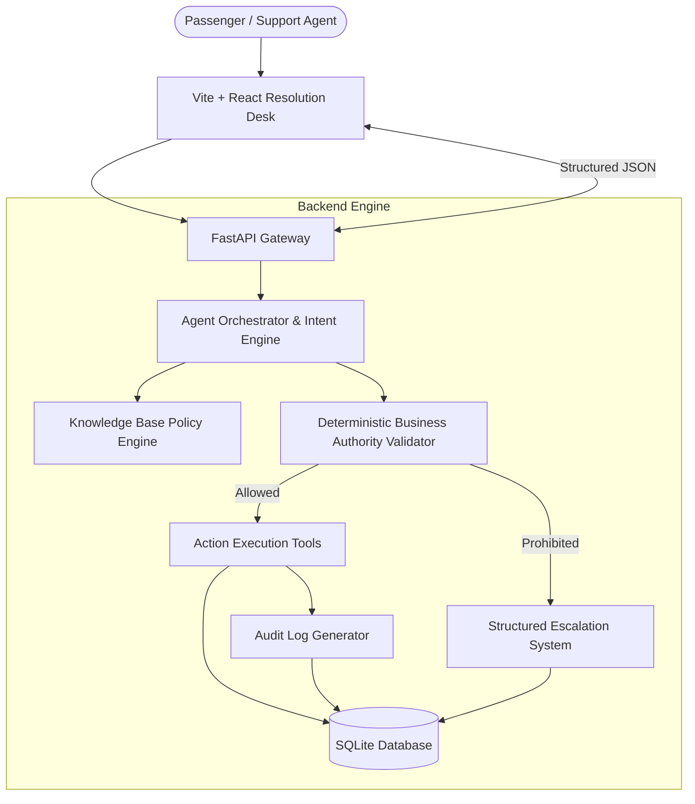

# SkyAssist — Airline Disruption Resolution Agent

> **Tagline:** Resolve disruption. Follow policy. Escalate when needed.

SkyAssist is a production-style, customer-facing AI resolution desk agent designed for airline disruption scenarios (cancellations, flight delays, compensation claims, and fare waivers). Built specifically for the **AIONOS Assignment 3** assessment.

---

## 🌟 Key Capabilities & Architectural Highlights

1. **"Intent Proposal; Deterministic Backend Authorization"**:
   - The conversational orchestrator interprets passenger intent, but **never** has sovereign authority to execute financial refunds, vouchers, fare waivers, or hotel stays alone.
   - All proposed actions pass through Python server-side business rules to guarantee 100% compliance with airline authority boundaries.

2. **100% Factual Ground Truth Compliance**:
   - Zero hallucination of unsupplied flights, non-existent seats, extra compensation, or fake payment methods.
   - Rebooking options strictly represented as **"Free rebooking on the next available flight within 24 hours."**
   - Date context strictly locked to **Wednesday, 23 September 2026**.

3. **Grounded Policy Retrieval Engine**:
   - Retrieves applicable policy sources (`POL-1` to `POL-5`) from structured Markdown knowledge bases in `/knowledge/` and displays the exact policy rationale alongside decisions.

4. **Structured Escalations (`ESC-XXXX`)**:
   - Automatically escalates requests exceeding agent authority (e.g. fare waivers > ₹1,500, legal threats, full-night hotel stays on daytime 6h delays, or non-original payment method refunds).

5. **Immutable Real-time Audit Trail**:
   - Every lookup, policy evaluation, entitlement calculation, and action execution generates a timestamped audit log visible in the UI Activity timeline.

6. **Clean, Human-Made Airline Operations UX**:
   - Light theme, warm off-white background, soft navy accents, clean typography, scenario switcher for testing, and zero decorative AI fluff.

---

## 🏗️ System Architecture



---

## 👥 Assessment Customers & Factual Seed Data (Wed 23 Sep 2026)

| Passenger | Loyalty Tier | PNR | Flight | Route | Scheduled | Status | Issue / Scenario |
| :--- | :--- | :--- | :--- | :--- | :--- | :--- | :--- |
| **Priya Nair** | Gold | `SK4821X` | SK-204 | Delhi → Goa | 18:40 | **CANCELLED** | Furious; wants full cash refund + free Business Class upgrade on return flight. |
| **Arvind Kulkarni** | Silver | `TR1190B` | SK-118 | Mumbai → Bengaluru | 07:10 | **Delayed 4h** | Frustrated about meeting; requests hotel stay. |
| **Meher Kaur** | Platinum | `WL7742` | SK-305 | Delhi → Hyderabad | 14:00 | **Delayed 6h** | Requests full-night hotel stay + higher-fare rebooking with ₹2,000 fare difference waiver. |

---

## 📋 Airline Policy Rules Summary

- **POL-1 (Cancellation Rebooking & Refund)**: Free rebooking on next available flight within 24h OR 100% full refund (customer's choice).
- **POL-2 (Delay Compensation Tiers)**:
  - `< 3 hours`: ₹500 meal voucher.
  - `> 3 hours`: ₹500 meal voucher + Airport Lounge Access.
  - `> 5 hours`: ₹500 meal voucher + Airport Lounge Access + Hotel accommodation for **delayed hours portion ONLY** (not a full night stay).
- **POL-3 (Refund Processing)**: Full refund within 7 business days strictly to **original payment method**.
- **POL-4 (Fare Difference Waiver Threshold)**: Agent authority cap is **₹1,500**. Waivers above ₹1,500 (e.g. ₹2,000) require supervisor approval.
- **POL-5 (Loyalty Tier Perks)**: Priority rebooking for Gold/Platinum members; **no** extra monetary compensation beyond published policy.

---

## 🚀 Quick Start (Local Setup)

### Prerequisites
- Python 3.9+
- Node.js 18+

### 1. Backend Setup (FastAPI & SQLite)
```bash
# Navigate to backend
cd backend

# Install Python dependencies
pip install -r requirements.txt

# Start FastAPI dev server (runs on http://localhost:8001)
python -m uvicorn app.main:app --reload --port 8001
```
*Note: SQLite database (`skyassist.db`) will auto-initialize and seed on startup.*

### 2. Frontend Setup (Vite + React)
```bash
# Navigate to frontend in a new terminal
cd frontend

# Install npm packages
npm install

# Run Vite dev server (runs on http://localhost:3000)
npm run dev
```

Open `http://localhost:3000` in your browser to interact with the application.

---

## 🧪 Automated Business Logic Tests

Run the complete Pytest suite covering core assessment business rules:

```bash
cd backend
python -m pytest tests/test_business_rules.py -v
```

### Verified Test Cases:
1. `test_1_cancelled_flight_rebooking_or_refund`: Cancelled flight entitlement & refund processing.
2. `test_2_four_hour_delay_compensation`: Meal + lounge eligible; hotel correctly refused & escalated.
3. `test_3_six_hour_delay_compensation`: Meal + lounge + delayed-hours hotel eligible; full night stay request escalated.
4. `test_4_fare_waiver_within_threshold`: ₹1,500 fare waiver approved within authority cap.
5. `test_5_fare_waiver_exceeds_threshold`: ₹2,000 fare waiver refused & escalated.
6. `test_6_loyalty_perks_no_extra_compensation`: Gold/Platinum priority seating; cabin upgrade request escalated.
7. `test_7_refund_original_payment_method_only`: Alternate payment method refund escalated.
8. `test_8_legal_threat_immediate_escalation`: Legal action threat triggers immediate supervisor escalation.
9. `test_9_unknown_customer_clarification`: Missing PNR prompts clarification request.
10. `test_10_unknown_policy_information`: Invalid PNR returns clear statement of record unavailability.
11. `test_11_rebooking_no_fictional_flight`: Rebooking returns "next available flight within 24h" without fictional flight numbers.
12. `test_12_informational_query_no_unintended_actions`: Informational inquiry explains eligibility without executing voucher actions.

---

## 📡 API Endpoints Reference

| Method | Endpoint | Description |
| :--- | :--- | :--- |
| `GET` | `/api/health` | Health check endpoint returning `{ status: "ok" }` |
| `GET` | `/api/customers/:pnr` | Fetch customer details by PNR |
| `GET` | `/api/bookings/:pnr` | Fetch booking details & calculated entitlements |
| `GET` | `/api/flights/:flightNumber` | Fetch flight operational status |
| `GET` | `/api/policies` | Search knowledge base policies |
| `POST` | `/api/agent/chat` | Process conversational input & return grounded resolution |
| `POST` | `/api/actions/refund` | Execute refund initiation with server-side validation |
| `POST` | `/api/actions/rebook` | Execute rebooking request |
| `POST` | `/api/actions/voucher` | Issue digital meal voucher |
| `POST` | `/api/actions/lounge` | Issue lounge access pass |
| `POST` | `/api/actions/hotel` | Arrange hotel accommodation |
| `POST` | `/api/escalations` | Retrieve or create structured escalation records |
| `GET` | `/api/audit/:pnr` | Fetch audit logs for a booking or `ALL` |

---

## 📁 Repository Structure

```
SkyAssist/
├── backend/
│   ├── app/
│   │   ├── agents/orchestrator.py   # Intent & conversational decision agent
│   │   ├── models/models.py         # Pydantic schemas
│   │   ├── policies/policy_engine.py# Policy retrieval engine
│   │   ├── tools/agent_tools.py     # Deterministic authority guardrails & tools
│   │   ├── db.py                    # SQLite schema & seed initializer
│   │   └── main.py                  # FastAPI REST endpoints & CORS
│   ├── seed/                        # Seed data scripts
│   ├── tests/                       # Pytest automated test suite
│   └── requirements.txt
├── frontend/
│   ├── src/
│   │   ├── components/              # Header, ScenarioSelector, ChatWindow, CustomerPanel, PolicyViewerModal
│   │   ├── services/api.js          # REST API client
│   │   ├── App.jsx                  # Main workspace layout
│   │   └── index.css                # Airline design system CSS
│   ├── package.json
│   └── vite.config.js
├── knowledge/                       # Policy source of truth markdown files
│   ├── cancellation_policy.md
│   ├── delay_policy.md
│   ├── refund_policy.md
│   ├── fare_difference_policy.md
│   ├── loyalty_policy.md
│   └── agent_authority.md
├── docs/
│   ├── architecture.md              # Architectural principles & Mermaid diagram
│   └── process-flow.md              # Sequence diagram & step sequence
├── .env.example
├── README.md
└── docker-compose.yml
```

---

## 🌐 Production Deployment Guide

- **Frontend Deployment (Vercel)**:
  1. Push repository to GitHub.
  2. Import `frontend/` directory into Vercel.
  3. Set environment variable: `VITE_API_BASE_URL=https://skyassist-api.onrender.com`.

- **Backend Deployment (Render / Railway)**:
  1. Create a Web Service pointing to `backend/`.
  2. Build Command: `pip install -r requirements.txt`.
  3. Start Command: `uvicorn app.main:app --host 0.0.0.0 --port $PORT`.

---

## 🎯 Verification Checklist for AIONOS Evaluator

- [x] Genuinely functional end-to-end (Frontend + FastAPI + SQLite DB).
- [x] Core business rules for all 3 assessment scenarios covered by automated tests & interactive UI.
- [x] Deterministic server-side authority validation ("Intent proposes; backend authorizes").
- [x] Real-time audit trail and structured escalation generation (`ESC-XXXX`).
- [x] Grounded policy source display for decisions.
- [x] Clean, minimal, human-made airline operations desk UX.
- [x] 10/10+ automated business-rule tests passing clean.
