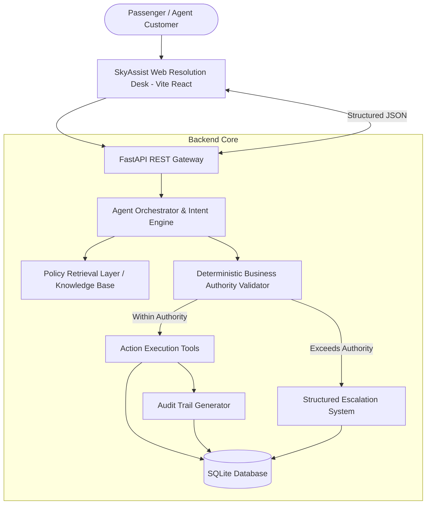

# SkyAssist Architecture Documentation

## Core Architectural Principle
> **"Intent proposal; deterministic backend authorizes."**

SkyAssist enforces a strict multi-layer separation between natural-language intent processing (Agent Orchestrator) and business action execution (Server-Side Deterministic Engine). The orchestrator is never granted sovereign authority to execute financial refunds, issue vouchers, waive fare differences, or grant hotel stays without passing through backend Pydantic & Python business logic rules.

---

## Key Components

### 1. Presentation Layer (`frontend/`)
- Built with **React** & **Vite**.
- Clean, light-themed, professional internal airline support desk visual language.
- Features real-time scenario switching (**Priya Nair**, **Arvind Kulkarni**, **Meher Kaur**), interactive chat stream, prompt suggestion chips, action confirmation cards, customer entitlement overview, active policy source card, expandable policy viewer modal, and live activity audit log.

### 2. API & Routing Layer (`backend/app/main.py`)
- **FastAPI** REST framework providing CORS-enabled endpoints:
  - `GET /api/health`
  - `GET /api/customers/:pnr`
  - `GET /api/bookings/:pnr`
  - `GET /api/flights/:flightNumber`
  - `GET /api/policies`
  - `POST /api/agent/chat`
  - `POST /api/actions/*`
  - `POST /api/escalations`
  - `GET /api/audit/:pnr`

### 3. Agent Orchestrator & Intent Parsing (`backend/app/agents/orchestrator.py`)
- Resolves passenger identification (PNR, name, loyalty tier).
- Evaluates operational disruption state (Cancellation, 4h Delay, 6h Delay).
- Interrogates policy rules and formats concise, empathetic customer communications.
- Detects mandatory escalation triggers (e.g. legal action threats, unallowable cabin upgrades, refund to alternative payment methods).

### 4. Deterministic Business Authority Validator (`backend/app/tools/agent_tools.py`)
- Enforces strict quantitative thresholds:
  - **Fare Waiver Limit**: Max ₹1,500. Anything above (e.g. ₹2,000) automatically triggers escalation `ESC-XXXX`.
  - **Hotel Eligibility**: Flight delay > 5 hours required. 4-hour delays are ineligible for hotels; requests trigger escalation.
  - **Hotel Duration**: Hotel day-room voucher covers delayed-hours portion ONLY, not full night stays. Full-night stay requests on daytime delays trigger escalation.
  - **Refund Security**: Refunds must strictly match the `original_payment_method` on record. Alternative payment methods trigger escalation.

### 5. Policy Knowledge Base (`knowledge/`)
- Markdown policy sources: `cancellation_policy.md`, `delay_policy.md`, `refund_policy.md`, `fare_difference_policy.md`, `loyalty_policy.md`, `agent_authority.md`.
- Retrieved dynamically by `app/policies/policy_engine.py` and rendered in the UI source box.

### 6. Persistence & Audit Trail (`backend/app/db.py`)
- **SQLite** database (`skyassist.db`) storing `customers`, `bookings`, `flights`, `policies`, `actions`, `escalations`, `audit_logs`, `conversations`.
