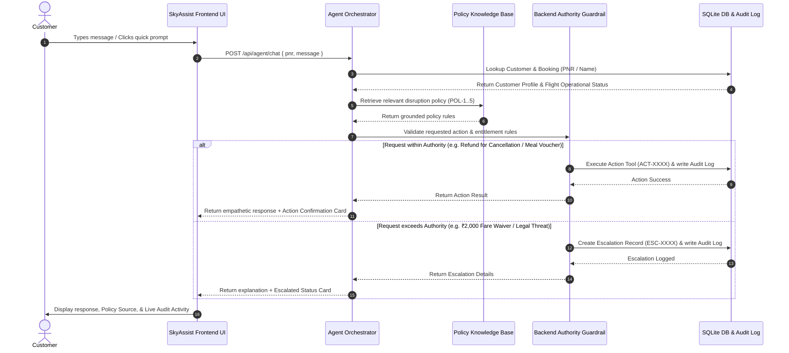

# SkyAssist Process Flow

This document details the step-by-step sequence of operations executed by SkyAssist when processing customer inquiries and disruption resolution requests.

---

## Detailed Step Sequence

1. **User Message Reception**: Passenger sends message or selects assessment scenario.
2. **Identity & Booking Resolution**: Orchestrator queries DB using PNR (`SK4821X`, `TR1190B`, `WL7742`) or passenger name.
3. **Operational Status & Policy Retrieval**: Query DB flights table and load matching policy (`POL-1` to `POL-5`).
4. **Guardrail Authority Evaluation**:
   - Check if request contains legal threat -> mandatory immediate escalation.
   - Check if refund requested to alternate payment method -> refuse & escalate.
   - Check if fare waiver exceeds ₹1,500 threshold -> refuse & escalate.
   - Check if hotel requested for delay ≤ 5h or full night stay -> refuse & escalate.
5. **Action Execution & Audit Trail**: Allowed actions create unique action IDs (`ACT-REF-XXXX`, `ACT-VOU-XXXX`, `ACT-LNG-XXXX`, `ACT-HTL-XXXX`) and write timestamped audit entries.
6. **Response Generation & Source Presentation**: Display grounded response, active policy source card, and live audit timeline.
